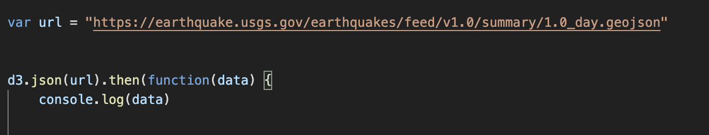
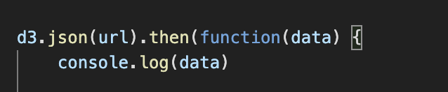
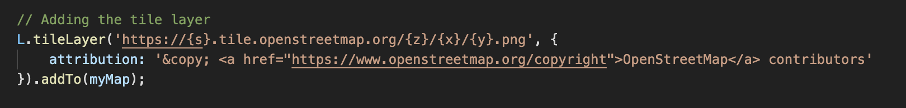
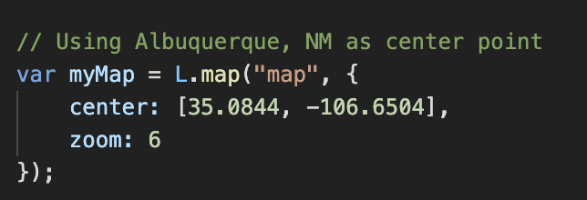

In this project, GeoJSON was used as a live, programatic interface to build a tool that showed significant earthquakes that had occured in the past 24 hours.  The GeoJSON feed is from the USGS' Earthquake Hazards Program and is of the type FeatureCollection.  

Using D3.js and the .then() method, the url can be called with a promise to execute the next step in the function.  

  

To make sure that data is feeding in correctly, console.log() is used.

  

Now that we know the data is coming in correctly, a base tile layer needs to be created.  This layer provides the map for any images to sit on top of.  Because the majority of earthquakes happen on the west coast, I chose to use Albuquerque, NM as the center point.

  
   

