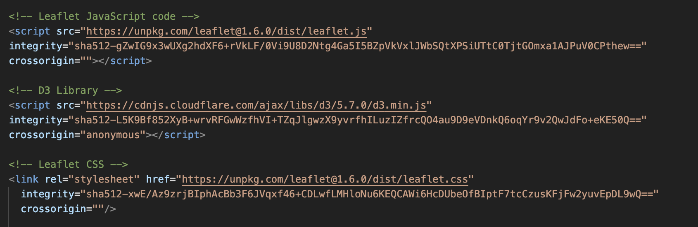

In this project, GeoJSON was used as a live, programatic interface to build a tool that showed significant earthquakes that had occured in the past 24 hours.  The GeoJSON feed is from the USGS' Earthquake Hazards Program and is of the type FeatureCollection.  

Using D3.js and the .then() method, the url was called with a promise to execute the next step in the function.  

  

To make sure that data was feeding in correctly, console.log() was used.

  
   

Once it was confirmed that the data was coming in correctly, a base layer was created.  This layer provided the base map for any images to sit on top of.  Because the majority of earthquakes happen on the west coast, Albuquerque, NM was chosedn as the center point.

  
   

Using the inspector, it could be seen that D3 returned the data as an object.  The object that was returned was an array of objects (bbox, features, and metadata).  From here, anonymous functions were created using D3's .then() promise to first pull the data and then run each of the specified functions below:

The first function <strong>getRadius</strong> was used to show the strength of the magnitude of each earthquake.  The bigger the earthquake, the larger the marker would be.  To adjust the size, a multiple of 4 was used.

  

Additionally, a function called <strong>getColor</strong> was used to add color to the magnitude of each earthquake.  The color scheme starts with light green representing the least severe earthquakes and ends with red representing the most severe earthquakes.  

  

Both the <strong>getRadius</strong> and the <strong>getColor</strong> functions were included in the "fillColor" and "radius" options for the <strong>circleMarker</strong> layer, which can be found in the <strong>pointToLayer</strong> below.

Next, a <strong>geoJson</strong> layer was created including Leaflet's <strong>pointToLayer</strong> and <strong>onEachFeature</strong> options to create the earthquake markers and bindPopups.  For both options, the functions were internally called when the data was added by passing the GeoJSON point feature and its LatLng.  

  

  
   

Finally, using a <strong>control layer</strong> a legend was created and placed in bottom right corner.  To seperate the labels and colors, a for loop was used to iterate through the the density intervals and generate a label with a colored square for each interval.

  

In order to be able to see the outputs of each function, they were added to the map layer, which was assigned to the variable <strong>"myMap"</strong>.  The "myMap" variable was then stored in the div <strong>map</strong>.

  

The following libraries also needed to be added to the html page in order to run D3 and Leaflet.

  

  
  

